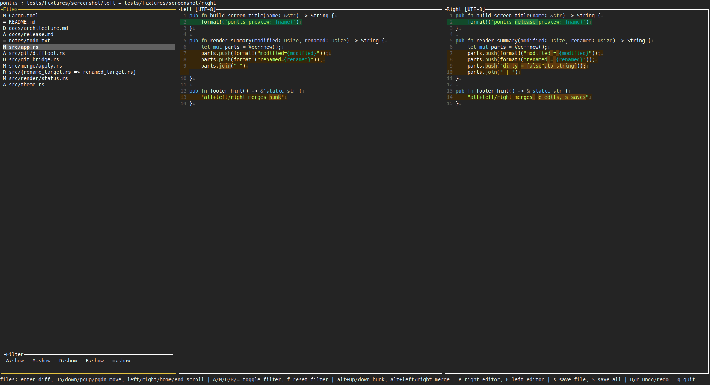

# pontis

`pontis` is a **TUI diff / merge tool** built with Rust and `ratatui`.

It is designed to keep **directory comparison, Git diff review, and hunk-based merge work** inside the terminal.

[日本語版README](./docs/README.ja.md)

---

## Features



* Recursive directory comparison
* Hunk-based merge in both directions
* Undo / redo
* Side-by-side diff with inline diff support
* Partial editing via `$EDITOR`
* Git support for working tree / index / revision comparison

---

## Installation

### Prebuilt binaries

Download the archive for your platform from GitHub Releases, extract it, and place the `pontis`
binary somewhere in your `PATH`.

### Install from source

```bash
cargo install --git https://github.com/nakkiy/pontis pontis
```

---

## Usage

### Local comparison

```bash
pontis <left> <right>
```

### Start with an explicit config file

```bash
pontis --config /path/to/config.toml <left> <right>
```

---

## Git Mode

### working tree vs HEAD

```bash
pontis git
pontis git --repo /path/to/repo
```

### index vs HEAD

```bash
pontis git --staged
```

### working tree vs revision

```bash
pontis git --rev <rev>
```

### index vs revision

```bash
pontis git --rev <rev> --staged
```

### revision pair

```bash
pontis git --diff <rev1> <rev2>
```

More details: [docs/GIT_INTEGRATION.md](docs/GIT_INTEGRATION.md)

---

## `git difftool` Integration

Setup:

```bash
git config --global diff.tool pontis
git config --global difftool.prompt false
git config --global difftool.pontis.cmd \
  'pontis git --repo "$PWD" \
    --diff "$PONTIS_GIT_DIFFTOOL_LEFT_REV" "$PONTIS_GIT_DIFFTOOL_RIGHT_REV" \
    --difftool-left-dir "$LOCAL" \
    --difftool-right-dir "$REMOTE"'
```

Run:

```bash
REV1=HEAD~1
REV2=HEAD

PONTIS_GIT_DIFFTOOL_LEFT_REV="$REV1" \
PONTIS_GIT_DIFFTOOL_RIGHT_REV="$REV2" \
git difftool --tool pontis --dir-diff "$REV1" "$REV2"
```

If you use this often, a helper function is convenient:

```bash
git-pontis-diff() {
  local rev1="$1"
  local rev2="$2"
  PONTIS_GIT_DIFFTOOL_LEFT_REV="$rev1" \
  PONTIS_GIT_DIFFTOOL_RIGHT_REV="$rev2" \
  git difftool --tool pontis --dir-diff "$rev1" "$rev2"
}
```

---

## `lazygit` Integration

```yaml
customCommands:
  - key: "D"
    context: "commits"
    description: "Compare the selected commit and its parent with pontis"
    command: >
      PONTIS_GIT_DIFFTOOL_LEFT_REV={{.SelectedLocalCommit.Hash}}^
      PONTIS_GIT_DIFFTOOL_RIGHT_REV={{.SelectedLocalCommit.Hash}}
      git difftool --tool pontis --dir-diff
      {{.SelectedLocalCommit.Hash}}^ {{.SelectedLocalCommit.Hash}}
    output: terminal

  - key: "R"
    context: "commits"
    description: "Compare the selected range with pontis"
    command: >
      PONTIS_GIT_DIFFTOOL_LEFT_REV={{.SelectedCommitRange.From}}
      PONTIS_GIT_DIFFTOOL_RIGHT_REV={{.SelectedCommitRange.To}}
      git difftool --tool pontis --dir-diff
      {{.SelectedCommitRange.From}} {{.SelectedCommitRange.To}}
    output: terminal
```

---

## UI Overview

### Left pane (file list)

* File list
* Status filters

### Right pane (diff)

* Side-by-side diff view
* Hunk-level actions
* Scroll and navigation

---

## Status Markers

| Marker | Meaning |
| --- | --- |
| `=` | unchanged |
| `?` | pending |
| `M` | modified |
| `R` | renamed / moved |
| `A` | added |
| `D` | deleted |
| `B` | binary |
| `*` | dirty |

---

## Key Bindings

### Common

| key | action |
| --- | --- |
| `q` | quit |
| `alt+↓ / ↑` | next / previous diff |
| `alt+→ / ←` | apply current hunk |
| `u / r` | undo / redo |
| `e / E` | open in editor |
| `s / S` | save |

---

### file list

| key | action |
| --- | --- |
| `enter` | focus diff |
| `↑/↓` | move selection |
| `PageUp/PageDown` | move by 10 entries |
| `←/→` | horizontal scroll |
| `Home/End` | jump to horizontal edge |
| `A/M/D/R/=` | filter |
| `f` | reset filters |

---

### diff

| key | action |
| --- | --- |
| `esc` | back to file list |
| `↑/↓` | scroll |
| `PageUp/PageDown` | scroll by 10 lines |
| `←/→` | horizontal scroll |
| `Home/End` | jump to horizontal edge |

---

## `$EDITOR` / Save Rules

* `pontis git` / `pontis git --rev`: only the right side is writable
* `pontis git --staged`: both sides are read-only
* `pontis git --diff` and the `git difftool` bridge: both sides are read-only
* External editor changes are first applied back into memory; save them explicitly with `s` / `S`
* Returning from the external editor clears merge undo / redo history

---

## Configuration

### config file

* `${XDG_CONFIG_HOME}/pontis/config.toml`
* `~/.config/pontis/config.toml`

```toml
backup_on_save = false
highlight_max_bytes = 524288
highlight_max_lines = 8000
theme = ""
inline_diff = true
line_ending_policy = "compare"
whitespace_policy = "compare"
line_numbers = false
line_ending_visibility = "hidden"
```

---

### Priority

* `CLI > environment variables > config file > default`

---

### Environment Variables

* `PONTIS_BACKUP_ON_SAVE`
* `PONTIS_HIGHLIGHT_MAX_BYTES`
* `PONTIS_HIGHLIGHT_MAX_LINES`
* `PONTIS_THEME`
* `PONTIS_INLINE_DIFF`
* `PONTIS_LINE_ENDING_POLICY`
* `PONTIS_WHITESPACE_POLICY`
* `PONTIS_LINE_NUMBERS`
* `PONTIS_LINE_ENDING_VISIBILITY`

---

### custom assets

Additional themes and syntax definitions can be placed in the following directories. If they do not exist, `pontis` runs with the built-in defaults only.

* `themes/` can contain Sublime Text / `syntect` compatible themes
* Themes placed there can be selected with `theme = "..."` in the config
* `syntaxes/` can contain Sublime Text / `syntect` compatible syntax definitions
* Syntax definitions placed there are loaded on startup

```
~/.config/pontis/themes/
~/.config/pontis/syntaxes/
```

More details: [docs/CONFIG.md](docs/CONFIG.md)

---

## Limits

* mixed `file/dir` input is not supported
* binary files are not shown as text diffs
* hunk merge is not available for binary files
* only UTF-8 text is supported
* UTF-8 BOM is preserved on write
* syntax highlighting is disabled for large files

---

## Roadmap

* reload support
* keyword filtering for the file list
* configurable key bindings
* install script and distribution automation

---
